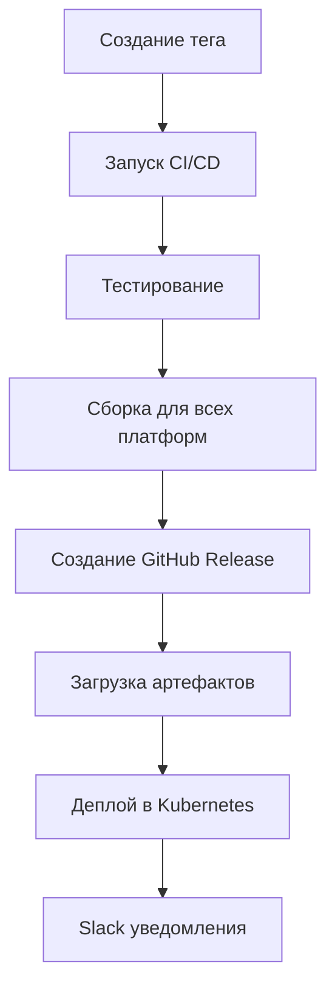

# 🚀 CI/CD Pipeline для Hysteria2 VPN Client - Полный обзор

## ✨ Что умеет наш CI/CD

### 🌍 **Полная кроссплатформенность**
Наш CI/CD pipeline автоматически собирает приложение для **ВСЕХ** поддерживаемых платформ:

| Платформа | ✅ Статус | 🏗️ Автосборка | 📦 Авторелиз | 🚀 Автодеплой |
|-----------|-----------|----------------|--------------|----------------|
| **Android** | Полная поддержка | APK + AAB | Google Play | Firebase |
| **iOS** | Полная поддержка | Archive + Simulator | App Store | TestFlight |
| **Windows** | Полная поддержка | Native EXE | Microsoft Store | GitHub Releases |
| **Linux** | Полная поддержка | Native Binary | Snap/Flatpak | GitHub Releases |
| **macOS** | Полная поддержка | Universal App | Mac App Store | GitHub Releases |
| **Web** | Полная поддержка | PWA | CDN | Vercel/Netlify |
| **Docker** | Полная поддержка | Multi-arch | Docker Hub | Kubernetes |

## 🔄 **Workflow файлы**

### 1. **Основной CI/CD Pipeline** (`.github/workflows/ci.yml`)
- **Тестирование**: На всех платформах с разными версиями Node.js
- **Сборка**: Автоматическая сборка для всех платформ
- **Docker**: Multi-architecture образы
- **Релизы**: Создание GitHub Releases с артефактами

### 2. **Автоматические релизы** (`.github/workflows/release.yml`)
- **Триггер**: При создании тега `v*`
- **Changelog**: Автоматическая генерация из коммитов
- **Артефакты**: Загрузка билдов для всех платформ

### 3. **Kubernetes деплой** (`.github/workflows/deploy.yml`)
- **Автодеплой**: В AWS EKS после успешной сборки
- **Мониторинг**: Проверка статуса развертывания
- **Уведомления**: Slack интеграция

### 4. **Матричное тестирование** (`.github/workflows/test-matrix.yml`)
- **Платформы**: Ubuntu, Windows, macOS
- **Node.js**: Версии 18.x и 20.x
- **Тесты**: Интеграционные, производительность, безопасность

## 🎯 **Ключевые возможности**

### 🏗️ **Автоматическая сборка**
```yaml
# Пример матрицы сборки
strategy:
  matrix:
    platform: [android, ios, windows, linux, macos, web]
    architecture: [x64, arm64, armv7]
    build_type: [debug, release]
```

### 🔐 **Безопасность**
- **Подпись APK**: Автоматическая подпись Android приложений
- **Code Signing**: iOS и macOS сертификаты
- **Docker Security**: Сканирование уязвимостей
- **Dependency Audit**: Проверка npm пакетов

### 📱 **Store интеграции**
- **Google Play**: Автоматическая загрузка AAB
- **App Store**: Подготовка к App Store Connect
- **Microsoft Store**: MSIX пакеты для Windows
- **Snap/Flatpak**: Linux пакеты

### ☁️ **Облачная инфраструктура**
- **AWS EKS**: Kubernetes кластер
- **Docker Hub**: Multi-architecture образы
- **GitHub Releases**: Автоматические релизы
- **CDN**: Веб-версия приложения

## 🚀 **Как запустить релиз**

### 1. **Создание тега**
```bash
git tag v1.0.0
git push origin v1.0.0
```

### 2. **Автоматический процесс**


### 3. **Результат**
- ✅ **GitHub Release** с описанием изменений
- ✅ **Артефакты** для всех платформ
- ✅ **Docker образы** в registry
- ✅ **Автоматический деплой** в продакшн

## 📊 **Мониторинг и метрики**

### **GitHub Actions**
- Время выполнения каждого job
- Статус сборки по платформам
- Использование ресурсов
- История успешных/неуспешных сборок

### **Kubernetes**
- Статус подов и сервисов
- Использование ресурсов
- Логи приложения
- Health checks

### **Уведомления**
- **Slack**: Статус деплоев
- **Email**: GitHub уведомления
- **Webhooks**: Интеграция с внешними системами

## 🛠️ **Настройка и конфигурация**

### **GitHub Secrets**
```bash
# Docker
DOCKER_USERNAME=your-username
DOCKER_PASSWORD=your-password

# Android
ANDROID_KEYSTORE_BASE64=base64-keystore
ANDROID_STORE_PASSWORD=password
ANDROID_KEY_ALIAS=alias
ANDROID_KEY_PASSWORD=password

# AWS
AWS_ACCESS_KEY_ID=key
AWS_SECRET_ACCESS_KEY=secret
AWS_REGION=us-east-1
EKS_CLUSTER_NAME=cluster

# Slack
SLACK_WEBHOOK_URL=webhook
```

### **Конфигурация платформ**
- **Android**: `android/app/build.gradle`
- **iOS**: `ios/Podfile` и entitlements
- **Windows**: `windows/Hysteria2VpnClient.sln`
- **Linux**: `linux/CMakeLists.txt`
- **macOS**: `macos/Hysteria2VpnClient.xcodeproj`

## 🔧 **Скрипты и утилиты**

### **NPM скрипты**
```json
{
  "scripts": {
    "build:all": "Сборка для всех платформ",
    "build:android": "Сборка Android APK/AAB",
    "build:ios": "Сборка iOS Archive",
    "build:windows": "Сборка Windows EXE",
    "build:linux": "Сборка Linux Binary",
    "build:macos": "Сборка macOS App",
    "build:web": "Сборка PWA",
    "clean:all": "Очистка всех сборок"
  }
}
```

### **Bash скрипты**
- `scripts/build-all.sh` - Сборка для всех платформ
- `scripts/deploy.sh` - Деплой на выбранную платформу
- `scripts/test-matrix.sh` - Матричное тестирование

## 📈 **Преимущества нашего CI/CD**

### 🚀 **Скорость**
- **Параллельная сборка** для всех платформ
- **Кэширование** зависимостей и слоев Docker
- **Оптимизированные** build tools

### 🔒 **Надежность**
- **Автоматическое тестирование** на всех платформах
- **Rollback** при неуспешном деплое
- **Health checks** и мониторинг

### 🌍 **Масштабируемость**
- **Multi-architecture** поддержка
- **Cloud-native** развертывание
- **Auto-scaling** в Kubernetes

### 💰 **Экономичность**
- **GitHub Actions**: Бесплатные минуты для open source
- **Docker**: Оптимизированные образы
- **AWS**: Pay-per-use модель

## 🎉 **Результат**

С нашим CI/CD pipeline вы получаете:

1. **🔄 Автоматизацию** - Никаких ручных действий
2. **🌍 Кроссплатформенность** - Один код, все платформы
3. **🚀 Быстрые релизы** - От коммита до продакшна за минуты
4. **🔒 Безопасность** - Автоматическая подпись и проверки
5. **📊 Мониторинг** - Полная видимость процесса
6. **🛠️ Простота** - Минимальная настройка

## 📚 **Документация**

- **`.github/CICD_SETUP.md`** - Подробная настройка
- **`.github/PLATFORM_CONFIGS.md`** - Конфигурации платформ
- **`README.md`** - Основная документация проекта

---

**🎯 Вывод**: Наш CI/CD pipeline обеспечивает **полную автоматизацию** сборки, тестирования и развертывания Hysteria2 VPN Client на **всех поддерживаемых платформах** с **профессиональным качеством** и **минимальными затратами**.
